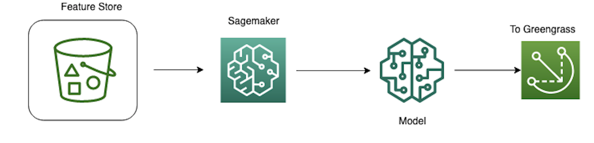
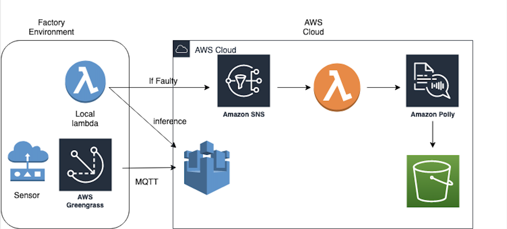
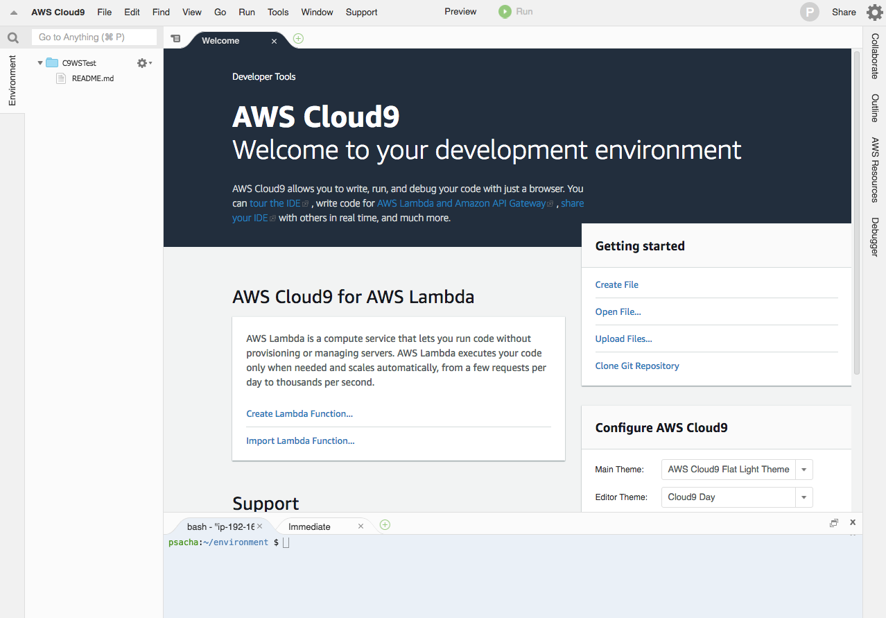
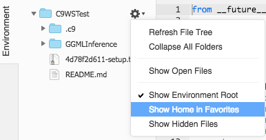
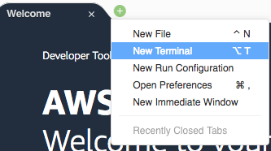
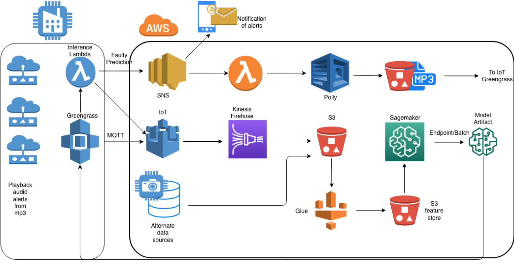
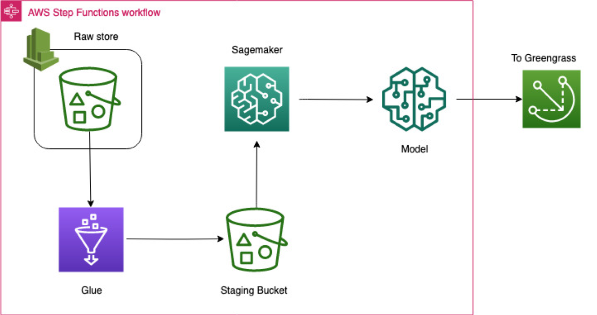

# Predictive Maintenance workshop using AWS IOT and AI/ML services.

Predictive maintenance techniques are designed to monitor the condition of equipment in industrial or home environments such as factory equipment, pumps and compressors, oil rigs etc., and determine whether or not the equipment is in need of maintenance, and if so, when. As opposed to routine scheduled maintenance, predictive maintenance has the potential to avoid unexpected downtime arising from potential issues that go uncaught in between maintenance windows. This is often a major cost concern particularly when the equipment in question is mission critical. Predictive maintenance also has the potential of avoiding costly repairs when they are not required, and as such can inform when the next scheduled maintenance should occur.


In this workshop, you will apply Machine learning to a predictive maintenance use case. Imagine that you are in charge of running some equipment in a factory. The equipment is monitored by sensors which generate regular signals about the condition and health of the equipment. Based on the signals, you want to predict whether the equipment is in need of maintenance or not. One of the major challenges with your environment is the lack of consistent internet connectivity, so any solution you deploy, needs to function even in the absence of a connection to the cloud. Following instruction inn this workshop, you will use AWS IoT and AI-ML capabilities to arrive at a potential proof-of-concept (PoC) solution.

1. [Solution Overview](#1-solution-overview)
2. [Prerequisites](#2-prerequisites)
3. [Architecture](#3-architecture)
4. [Getting Started: Deploy your Cloud Formation template](#4-getting-started-deploy-your-cloud-formation-template)
5. [Install Greengrass, register IoT thing and connect to Greengrass](#5-install-greengrass-register-iot-thing-and-connect-to-greengrass)

    5.1 [Provision the Greengrass group and core](#51-provision-the-greengrass-group-and-core)
    
    5.2 [Register an IoT Thing with AWS IoT](#52-register-an-iot-thing-with-aws-iot)

    5.3 [Register IoT Device with AWS Greengrass](#53-register-iot-device-with-aws-greengrass)

    5.4 [Set up the IoT sensor](#54-set-up-the-iot-sensor)
    
6. [Explore data, build, train and deploy a model in Amazon SageMaker](#6-explore-data-build-train-and-deploy-a-model-in-amazon-sagemaker)
7. [Deploy the predictive-maintenance-advanced Lambda](#7-deploy-the-predictive-maintenance-advanced-lambda)

    7.1 [Create Lambda function to deploy to Greengrass Core](#71-create-lambda-function-to-deploy-to-greengrass-core)
    
    7.2 [Create a SNS topic](#72-create-a-sns-topic)

    7.3 [Deploy the Lambda function locally to Greengrass Core](#73-deploy-the-lambda-function-locally-to-greengrass-core)

8. [Create Polly Lambda function](#8-create-polly-lambda)
9. [Configure Lambda function to read data from sensors](#8-configure-lambda-function-to-read-data-from-sensors)
10. [Configure Lambda function to send prediction to AWS IoT and deploy the solution](#10-configure-lambda-function-to-send-prediction-to-aws-iot-and-deploy-the-solution)

    10.1 [Configure Lambda function](#101-configure-lambda-function)
    
    10.2 [Deploy lambda function to Greengrass Core](#102-deploy-lambda-function-to-greengrass-core)

    10.3 [Troubleshooting](#103-troubleshooting)

    10.4 [Trigger Polly](#104-trigger-polly)

## 1. Solution overview

You will start by collecting data generated by the sensors. A local lambda function deployed on the factory floor will make API calls to the machine learning model you trained on the AWS Cloud, which is also deployed locally at the factory(more on why you want to do this later). The lambda function will send notifications to the IoT cloud whether the part is Faulty or Not. If the part is not Faulty, no further action is taken. If a faulty part is found, the Lambda function will publish a message to an Amazon SNS topic of your choice. A second lambda function, listening on this topic will automatically be triggered. This Lambda function will call the Amazon Polly API to convert the body of the notification to speech. The speech file will be asynchronously generated and saved in Amazon S3. You can download this file and play it on your factory floor to let the floor manager know that there is an issue with a part. 

**The following AWS Services are leveraged:**

AWS Greengrass

AWS IoT

Amazon S3

Amazon SageMaker

Amazon SNS

Amazon Polly

AWS Cloud9

AWS CloudFormation

Amazon EC2

**Key takeaways of this workshop are the following:**

  1) Casting the use case into a supervised learning problem.

  1) An understanding of some of the challenges when using ML for predictive maintenance.
  
  2) Deploy an architecture that leverages AWS ML and AI services, and learn how they interact with IoT services such as AWS GreenGrass to perform predictive maintenance on-premises.
  
  3) Next steps towards taking this architecture to an end-to-end cloud solution.
 
## 2. Prerequisites

1) AWS Account
2) Laptop
3) Browser
4) Basic Linux/Python knowledge

## 3. Architecture

The architecture for this workshop comprises of two parts:

### Machine Learning:

We will assume that we have a simple S3 datalake where we will upload our training data used to train the model. The Machine learning model will be trained in Amazon SageMaker and the model artifacts will be deployed to the Greengrass core via S3.



### IoT Architecture:

Once the model is deployed, you will build the following architecture which links the machine learning model to AWS IoT and leverages Amazon Polly to convert text to speech to generate mp3 files that can be played over the PA system in the factory floor.



 
## 4. Getting Started: Deploy your Cloud Formation template

Architecturally, this workshop comprises of two parts: your factory environment (FE) and the AWS cloud.

The FE is where your equipment and sensors live which are monitoring the condition of the equipment. In order to keep track of the sensor data, they need to send the data to the AWS Cloud. The service that accomplishes this is called IoT Greengrass. Greengrass is a software that can be installed in your local factory servers which allows you to send sensor data and messages to and from the cloud using secure MQTT messaging. For more on Greengrass service, please check out: https://aws.amazon.com/greengrass/

Here we will mimic your local FE with an EC2 instance. Launch the following Cloudformation template in your AWS account that you are using for this workshop. 

Launch CloudFormation stack in **us-east-1** only: [](https://console.aws.amazon.com/cloudformation/home?region=us-east-1#/stacks/new?stackName=predictivemaintenance&templateURL=https://iot-ml-predictive-maintenance.s3.amazonaws.com/iot-ml-predictive-maintenance.json)

**This template will create the following resources:**

1. An **S3 bucket** for use throughout this workshop. You will use this bucket to store your machine learning model, Polly notifications and any data used for training and testing.

2. **VPC + public Subnet  and security groups** for an EC2 instance.

3. **Cloud9** instance where you will run your code and deploy your Greengrass core. Cloud9 is an AWS IDE where you will be able to write code and deploy scripts on your underlying EC2 instance. You will use this environment to install your Greengrass core.

4. A **SageMaker notebook environment** to build, train and deploy machine learning models. 

5. An **EC2** instance which will mimic your FE. The EC2 instance comes bootstrapped with custom python libraries necessary for running this workshop.

After you have been redirected to the Quick create stack page at the AWS CloudFormation console take the following steps to launch you stack:

1. On 'Create stack', leave everything as default and click Next
2. Under 'Specifc stack details', you can leave everything by default, or you can change Parameters, and click Next
    - Cloud9 instance type: (Optional) Select a Cloud9 instance type. The preselected m4.large is sufficient to run the workshop. <br/>
    - SageMaker instance type: (Optional) Select a SageMaker instance type. The preselected ml.t2.medium is sufficient to run the workshop. <br/>
3. Leave everything as default under 'Configure Stack options', click Next
4. Review and scroll down to Capabilities -> check I acknowledge that AWS CloudFormation might create IAM resources. <br/>
5. At the bottom of the page click Create stack. <br/>
6. Wait until the complete stack is created; it should take round about 10mins. <br/>
7. In the Outputs section for your stack in the CloudFormation console you find several values for resources that have been created: Cloud9, S3 bucket name, SageMaker instance... You can go back at any time to the Outputs section to find these values.<br/>

### Access the SageMaker Notebook Instance

Go to outputs section for your stack **predictivemaintenance** in the AWS CloudFormation console

**SageMakerInstance**: Right-click the corresponding link and select Open link in new tab. Hint: If the link is not clickable, try copying and pasting it into the address bar of a new web browser window or tab.
You will be redirected to your SageMaker instance.

### Access the Cloud9 IDE

Go to outputs section for your stack **predictivemaintenance** in the AWS CloudFormation console

**Cloud9IDE**: Right-click the corresponding link and select Open link in new tab. Hint: If the link is not clickable, try copying and pasting it into the address bar of a new web browser window or tab.
You will be redirected to your Cloud9 IDE
You should see a website similar to this one:



### Make your home folder visible

A bunch of files (to be used in other workshops) has been copied onto the Cloud9 IDE. By default the content of the home folder is not shown. So you need to change this.

In your Cloud9 IDE in the left pane:



1) Click the arrow next to the setting wheel
2) Click Show Home in Favorites


### Copying Files from/to the Cloud9 IDE

Files could be uploaded either directly with the Cloud9 IDE or indirectly via an S3 bucket or locally from your laptop. You will need to copy the configuration file for your Greengrass Core to the Cloud9 instance later during the workshop.

Cloud9 IDE process for later in the workshop

Upload a file: In the File menu choose Upload Local Files...
Download a file: Right-click on the filename > Download.

### Open a Terminal

To open a terminal (shell) in the Cloud9 IDE click the + in the tab bar and select New Terminal.
You will use this terminal to install and run the Greengrass core.



## 5. Install Greengrass, register IoT thing and connect to Greengrass

### 5.1. Provision the Greengrass group and core

The Greengrass group allows you to cluster resources together which need to communicate with one another. For example, multiple sensors on your factory floor, or IoT devices in your home may constitute a Greengrass group. By provisioning this group, you can also create local lambda functions which can run even when the FE goes offline. This is crucial for heavy industrial environments where consistent internet access isn't always a given.

Furthermore, the Greengrass group allows you to locally deploy machine learning models in your FE, which are trained in the cloud. 

**To get started go to the AWS Greengrass console and create a new Greengrass group and permission**

1. Groups <br/>
2. Create Group <br/>
3. Greengrass needs your permission to access other services. Click 'Grant permission' to create 'Greengrass_ServiceRole' to provide permission to Greengrass.
4. Use default creation <br/>
5. Group Name: greengrass-predictive <br/>
6. Next <br/>
7. Leave Name for Core untouched <br/>
8. Next <br/>
8. Create Group and Core <br/>
10. Download these resources as a tar.gz (A tar.gz-file which contains key/certificate and configuration for Greengrass) <br/>
11. Finish (you might need to scroll down to find this button) !!! Don't forget to click "Finish". Otherwise your group will not be created !!! <br/>
11. Verify in the AWS IoT console that your Greengrass Group has been created <br/>

The Greengrass service role that you just create is an IAM service role that authorizes AWS IoT Greengrass to access resources in your AWS account on your behalf. You need to associate this role to current AWS account. To allow AWS IoT Greengrass to access your resources, in a Cloud9 terminal run this command: 

```bash
#retrieve service role 
aws greengrass get-service-role-for-account --region us-east-1

#associate service role with your account
aws greengrass associate-service-role-to-account --role-arn arn:aws:iam::<YOUR_AWS_ACCOUNT_ID>:role/Greengrass_ServiceRole
```

Now you need to create a Greengrass group role. The Greengrass group role is an AWS Identity and Access Management (IAM) role that authorizes code running on a Greengrass core to access your AWS resources. 

Go to IAM console to create an IAM role.

1. Roles <br/>
2. Create role <br/>
3. AWS service <br/>
4. Greengrass <br/>
5. Next: Permissions <br/>
6. Check AWSGreengrassResourceAccessRolePolicy <br/>
7. Next: Review <br/>
8. Role name: GreengrassRole (Note that role names must be unique. You will need to keep track of the RoleARN for the rest of this workshop) <br/>
9. Create Role <br/>
10. After creating the role, make a note of the role ARN to use it later. <br/>

You can also find the role arn in the IAM console: <br/>
1. Go to IAM console, click Roles. <br/>
2. Type GreengrassRole in the search field <br/>
3. Click GreengrassRole <br/>
4. You'll find the role arn in the top of the window <br/>

For this workshop we will need to attach 2 more policies to this role.

1. Cick on Attach policies <br/>
2. Find: AmazonS3ReadOnlyAccess and click Attach policy <br/>
3. Repeat the steps for AmazonSNSFullAccess <br/>

This will allow Greengrass to obtain the machine learning model artifacts from your S3 bucket for deployment. It will also alow your local lambda function to publish messages to an SNS topic and call the SNS APIs.

Now you need to associate this role to Greengrass Group greengrass-predictive. You should see the permissions associated with the role now appear in the Settings of the Greengrass group.

1. Go back to Greengrass Console. <br/>
2. Go to Groups --> greengrass-predictive --> Settings <br/>
3. In GroupRole, click on the "Add Role" <br/>
4. For IAM role, select GreengrassRole and click Save </br>
5. You should see the role and policies in the Settings


**Copy and unpack the tar.gz-file**
By default Cloud9 home folder size is 10GB. Let's expand this folder so that you will have more space to work on by running resize.sh script.

```
bash

cd /tmp
./resize.sh

```

After expanding home folder size, you can configure Greengrass core.Copy (use S3/Cloud9 IDE as mentioned above) the downloaded tar.gz-file onto your Cloud9 IDE in the home folder /home/ec2-user/. The tar.gz file's name is similar to -setup.tar.gz <br/>
The tar.gz file contains keys, certificate and a configuration file (config.json) which will be used to configure your Greengrass Core. <br/>

In a Cloud9 terminal:

```bash
sudo tar zxvf /home/ec2-user/<unique-string>-setup.tar.gz -C /greengrass/
```

Now you are ready to start your Greengrass core.

But before you start the Greengrass daemon subscribe to the following topics. If the Core starts correctly you can observe activities on that topics.

Go to the AWS IoT Core console

1. Test <br/>
2. Subscribe $aws/events/# and $aws/things/# <br/>
3. Now fire up Greengrass on your EC2 instance <br/>

In a Cloud9 terminal:

```bash
cd /greengrass/ggc/core
sudo ./greengrassd start
```

Look at the MQTT client in the AWS IoT console for output.

You need to become root to access the log-directories on the Greengrass Core:

```bash
sudo su -
```

In a Cloud9 terminal:

```bash
cd /greengrass/ggc/var/log/system/
tail -f *.log
```

If there are any problems when starting AWS Greengrass check file "crash.log" for errors:

```bash
/greengrass/ggc/var/log/crash.log
```

Your AWS Greengrass Core should now be up and running.

### 5.2. Register an IoT Thing with AWS IoT.

The IoT Thing is the Cloud representation of your IoT device, in this case the sensor which is collecting data about the equipment in your factory.

1. Go to the IoT Core <br/>
2. Onboard --> Get Started<br/>
3. Onboard a device --> Get started <br/>
4. Review the steps to register a device --> click Get started <br/>
5. Choose Platform Linux/OSX and AWS IoT Device SDK Python <br/> 
6. Next <br/>
7. Thing Name: Iot-Sensor
8. Next Step <br/>
9. Download connection kit for Linux/OSX and save it on your machine <br/>
10. Next Step.
11. Click Done

In your Cloud9 terminal, right click folder **/home/ec2-user/environment**, and click New Folder. <br/>
Name the New folder IotSensor <br/>
upload the **connect_device_package.zip** file into this folder and follow the steps indicated in a new terminal window <br/>

Unzip the **connect_device_package.zip** file in folder IotSensor. Then change permission of start.sh script to start sending data to AWS IoT

```bash
cd /home/ec2-user/environment/IotSensor
unzip  connect_device_package.zip
chmod 755 start.sh
```

**Note: you may have to enable root access in your terminal for your start shell script to excecute correctly. This can be done by typing:**
```bash
sudo ./start.sh
```


### 5.3. Register IoT Device with AWS Greengrass

Once the IoT device has been registered, we still need to connect the IoT device to Greengrass. This way, the IoT device will send messages to Greengrass and will be able to trigger Lambda functions that are deployed on the Greengrass core.

To do so we first need to register the IoT device with the Greengrass core. 

1. Go to Greengrass, Groups <br/>
2. Click on greengrass-predictive <br/>
3. Go to Devices --> Add Device --> Select and IoT Thing --> Select Iot-Sensor --> Finish.

Next we need to change the permission policy of the Iot-Sensor so that it can Discover the Greengrass core automatically.

1. Click on Manage --> Things --> Iot-Sensor <br/>
2. Security <br/>
3. Click the Certificate <br/>
4. Policies <br/>
5. IoT-Sensor-Policy <br/>
6. Edit Policy Document <br/>

Paste the json below in the box. You may need to overwrite the existing json document.

```json
{
  "Version": "2012-10-17",
  "Statement": [
    {
      "Effect": "Allow",
      "Action": [
        "iot:Publish",
        "iot:Subscribe",
        "iot:Connect",
        "iot:Receive",
        "greengrass:Discover",
        "iot:DeleteThingShadow",
        "iot:GetThingShadow",
        "iot:UpdateThingShadow"
      ],
      "Resource": [
        "*"
      ]
    }
  ]
}
```

Click *save as new version*.

Next we will replace the simple Hello World messages coming through from the Iot device with actual sensor data. 

### 5.4. Set up the IoT sensor

To start sending sensor messages to the Greengrass core and AWS IoT complete the following steps.

In the Greengrass core, click on Groups --> greengrass-predictive --> Devices <br/>
Click ... on the top right where it says Local Shadow Only <br/>
Select: Sync to the Cloud <br/>

For every IoT thing registered on Greengrass, IoT creates a thing shadow. A shadow is a JSON document that is used to store current or desired state information for a thing. When the thing shadow is syncing to the cloud, it is constantly updating itself with the most recent state of the IoT Device. AWS IoT Greengrass devices can interact with AWS IoT device shadows in an AWS IoT Greengrass group, and update the state of shadow. To do so, create the subscription following steps below. The thing shadow interacts with the IoT Device and AWS IoT on a special messaging topic **$aws/things/Iot-Sensor/shadow/**

Go to Greengrass Groups --> greengrass-predictive.
1. Go to Subscriptions <br/>
2. Add subscription <br/>
3. Source --> Devices --> Iot-Sensor <br/>
4. Target --> Local Shadow Service <br/>
5. Next <br/>
6. In the topic filter enter: $aws/things/Iot-Sensor/shadow/update
7. Next --> Finish

Add another subscription this time choosing the Local Shadow Service as the Source and Iot-Sensor as the target
Enter Topic filter: $aws/things/Iot-Sensor/shadow/update/accepted. Click Next --> Finish

Now go the Cloud9 terminal

Under **/home/ec2-user/environment**, clone the following Github repository: **https://github.com/aws-samples/amazon-sagemaker-predictive-maintenance-deployed-at-edge.git**

Next, move the IotSensor.py and gg_discovery_api.py into the folder IotSensor. This is important because your start shell script will now execute the IotSensor.py file. 

Finally open the start.sh script in Cloud9. Navigate to the last line of the script and replace the 
"aws-iot-device-sdk-python/samples/basicPubSub/basicPubSub.py"  with **IotSensor.py** and at the end add:

```python
--connect-to greengrass
```
The final script should look something like this (note: yourhashID-ats is the unique ID for your AWS IoT endpoint. Please keep this hashID as it is in this script):

```python
python IotSensor.py -e yourhashID-ats.iot.us-east-1.amazonaws.com -r root-CA.crt -c Iot-Sensor.cert.pem -k Iot-Sensor.private.key --connect-to greengrass
```

Now we are ready to deploy the Iot device to the Greengrass core.

In the Cloud9 Terminal navigate to the folder containing your start.sh shell script:

```bash
sudo ./start.sh
```
Your Iot device should successfully discover the Greengrass core. 

To check that the Iot device is updating the thing shadow, go to AWS IoT --> Test --> Subscribe to topic $aws/things/Iot-Sensor/shadow/update
If things are working correctly, you should start seeing messages coming through.

**Troubleshoot greengrass core**

If there are any errors, you can check the logs to troubleshoot. To access the logs, open a new terminal window in Cloud9. To do this, click on the + symbol and click New Terminal.

In the terminal window type in

```bash
sudo su
cd /greengrass/ggc/var/log
ls
```
This will give you access to the runtime and crash logs. 
Once a Lambda function is configured, you will also see user logs.

## 6. Explore data, build, train and deploy a model in Amazon SageMaker

Next, go to the Outputs section of the CloudFormation template and click on the link to your SageMaker notebook instance. Alternatively, simply go to SageMaker in the AWS Console and you should find your notebook instance up and running.

The SageMaker notebook instance should already have a github repo cloned into the home directory. 

Go to **amazon-sagemaker-predictive-maintenance-deployed-at-edge** directory and open **Dataset_Preprocess.ipynb**. Run this notebook to generate the train and test datasets. 


Open **predictive-maintenance-xgboost.ipynb** and run this notebook to build and train your model. For a kernel, choose **conda python3**. 

**Remember to change default S3 bucket name to your bucket name (as a string in quotes) in the code cell where the Markdown prompts for a bucket. This is where your training, test and validation data will be stored, as well as your trained model artifacts.**

To find S3 bucket name, go to CloudFormation and click on **predictivemaintenance** stack, click on **Outputs** and you will see your bucket nex to **S3Bucket**

To build and train a machine learning model using Amazon SageMaker for predictive maintenance, execute each code cell and read through the text in the Markdown.

Note: Ignore the warning you receive when you get the Docker image in the "get_image_uri_" command. 

As your model trains, training metrics will be generated in the SageMaker notebook as well as in the SageMaker console. Once the training is complete, SageMaker will automatically tear down the compute resources required for model training. You are only billed for the time the training runs and the instance type used. 

One you run through all the cells in this notebook, navigate to your S3 bucket and make sure a trained ML model is created in the output folder. 

### Working with Jupyter notebooks

Cells in notebooks containing code which should be executed have square brackets [ ] left from the cell.

[ ] Cell has not been executed <br/>
[*] Cell is active. Depending on the code it could take some while for a cell to execute <br/>
[X] where X is any number like [6] means that the code in the cell has been executed <br/>


Execute cells:

Use Run at the top of the screen <br/>
Ctrl+<Enter> on the keyboard <br/>

## 7. Deploy the predictive-maintenance-advanced Lambda

### 7.1. Create Lambda function to deploy to Greengrass Core

We will create a Lambda function that will be deployed locally to Green Core. This function will download the machine learning model that you build earlier, and use this model to do inference on incoming sensor data to predict if device failure. 

To prepare for the code of this function, from the repository you cloned in the Cloud9 environment, copy the lambda function predictlambda.py and the folder greengrasssdk to your local device.

Open up a Terminal and Navigate to the folder where you downloaded the files and zip the two files together using the command

```bash
zip -r predictlambda.zip predictlambda.py greengrasssdk
```

Next we create an IAM role for the lambda functions to control permission. Normally, as a best practice, we want to follow the principle of least privelege and grant the lambda functions *only* the access they need. However, for simplicity, we will cheat a little here and create a single role for both lambda functions.

1. Go to IAM --> Role --> Create Role --> AWS Service --> Lambda --> Next:Permissions <br/>
2. Choose AWSLambdaBasicExecutionRole in the Roles <br/>
3. Next Tags. Click Next: Review <br/> 
4. Enter Role Name: **Predictivelambdarole** <br/>
5. Hit Create Role <br/>

Now Navigate to the Role you just created. As before, we will add some policies to this role. <br/>

1. Click on Attach policies <br/>
2. Attach the following policies to the role: AmazonS3FullAccess, AmazonPollyFullAccess and AmazonSNSFullAccess <br/>

Now we are ready to create this Lambda function. Next navigate to the Lambda console.

1. Click on Create Function <br/>
2. Choose Author from Scratch <br/>
3. Call the function **predictive-maintenance-advanced** <br/>
4. For RunTime choose **Python 3.7** <br/>
5. For IAM, expand the arrow under permissions titled "choose or create an execution role" and click on Use an existing role and find the role you just create **Predictivelambdarole** in the drop down menu. <br/>
6. Hit Create Function.

You should see a lambda function created. Explore the Lambda function console, you will find a list of services to which the Lambda function has permissions to read/write from listed. You will also see triggers. This lambda function will be deployed on Greengrass and triggered by the Iot Sensor in your FE, so we won't add a trigger here.

1. Next, navigate to Function Code <br/>
2. In Code Entry Type -- Choose upload a .zip file --> Upload predictlambda.zip <br/>
3. For Runtime choose Python 3.7 <br/>
4. For Handler enter predictlambda.lambda_handler <br/>
5. Click Save <br/>

You should see your Lambda code appear in the IDE. 

Study the lambda code:

1) Upon being triggered by the IoT Sensor, the lambda function extracts the relevant data point from the sensor. <br/>
2) The Lambda function then invokes the ML model you created earlier <br/>
3) The lambda function notifies AWS Iot that a prediction has been made <br/>
4) If the prediction is faulty (```python pred == 1```), the Lambda function sends a message to SNS (you will need to create SNS topic in next step)

### 7.2. Create a SNS topic

To receive a notification if the prediction is faulty, you create SNS topic and subscribe your email to this topic. In the AWS Console, navigate to SNS and Click Topics on the left hand panel.

1. Create Topic<br/>
2. Enter a name --> Create Topic<br/>
3. Create Subscription<br/>
4. Copy the topic ARN to your clipboard<br/>
5. Protocol --> Email<br/>
6. Enter your email address<br/>
7. Create Subscription<br/>

You should receive an email asking you to confirm the subscription.
Once you confirm, you should be all set!

Navigate back to the lambda function you just created and in the IDE. <br/>
For the TOPIC_ARN, replace the existing field with the ARN of the topic you just created. <br/>
For the LAMBDA_TOPIC, replace the topic with a different name of your choosing or leave as is. Save this topic in a text file for later use. <br/>

Click Save

### 7.3. Deploy the Lambda function locally to Greengrass Core

Our Lambda function should be able to make predictions on the ML model even without internet connectivity. For this reason,the Lambda needs to be deployed on the Greengrass core and not live in the AWS Cloud.

In your Lambda function:

1) Save the Lambda function and click on Actions --> Publish as new version. <br/>
2) Leave the Version Description field blank and click Publish. <br/>
3) Next in Actions, click Create alias. Give the alias a name and for version click the Version Number, not Latest. Hit Create. <br/>
**Complete steps 4-5 everytime you update Lambda function**
4) If you make any subsequent changes to your Lambda code, every time you need to Save and Publish as new version. Then you need to associate Alias to the last version. To do so, click on Qualifiers -> Alias. Click on the alias you just created and scroll down. <br/>
5) Under Alias configuration, click Edit. Change the version to the most recent version number (This will usually be the highest number). Remember **do not** set the version to **$LATEST** Currently Greengrass does not support deploying aliases pointing to the $LATEST. <br/>
6) Go back to the Greengrass console --> Groups --> greengrass-predictive <br/>
7) Click on Lambas --> Add Lambda --> Use Existing Lambda --> Enter *predictive-maintenance-advanced* in the search and locate your lambda function <br/>
8) Click Next --> Choose Alias. Hit Finish <br/>
9) Once you see the Lambda function appear, click on the *...* above where it should say Using alias -- youraliasname. Click Edit Configuration. <br/>
10) Increase the memory limit to **256MB** <br/>
11) In Lambda lifecyle choose **Make this function long-lived and keep it running indefinitely** <br/>
12) Update

Next navigate back to your Greengrass group and click **Resources**.
1) Choose Machine Learning  --> Add a machine learning resource <br/>
2) Name your model **xgboost-model** <br/>
3) For Model source, choose  Upload a Model from S3 <br/>
4) Navigate to your S3 bucket --> folder xgb --> sagemaker-xgboost-* --> output. Click  model.tar.gz <br/>
5) For local path enter **/greengrass-machine-learning/xgboost/** (This path has already been entered in your lambda function and must match)
6) In Lambda Function Affiliations, select your Lambda function.  Choose the permission ‘Read and Write access’ , click **Save**

Greengrass will now copy your model.tar.gz file to this local folder and untar the model artifacts. By associating your Lambda function with this local model path, the Lambda function knows to look in the Greengrass core to unpickle the model object and make predict calls to the model when triggered.

In Resources --> Machine Learning you should now see your machine learning model affiliated to your lambda function. If the model is still unaffiliated, give it a few seconds. If the problem persists, make sure you included the correct lambda function in the affiliations. 

## 8. Create Polly Lambda

Next we will create a second lambda function which is triggered whenever a message is published to the SNS topic we just created.

To create this lambda function, follow the steps above for creating a lambda function but give it a different name from the one you just created. For example, call it PollyLambda <br/>
1. For IAM roles, assign this function the same role as above **Predictivelambdarole** <br/>
2. Hit Create Function

Next we will trigger this lambda function using SNS.

1. In the Lambda function environment, in the Designer window, click on **+ Add Trigger** and choose **SNS** from the drop down menu. <br/>
2. Select the SNS topic ARN for the topic you created <br/>
3. Make sure "Enable Trigger" box is checked <br/>
4. Click Add <br/>

5. In the Function Code menu, select **Edit Code Inline** <br/>
6. In a separate window, from the Cloud 9 Terminal, navigate to the folder where you cloned the Git Repo, select and open PollyLambda.py <br/>
7. Delete the default handler code and copy and paste the code in the Lambda function <br/>
8. For Runtime Choose Python 3.7 <br/>
9. In the Handler, replace with lambda_function.lambda_handler. <br/>
10. Increase timeout limit for this function by scrolling down to 'Basic settings', click Edit, increase timeout from 3 to 30 seconds. Click Save

Examine this Lambda function. It is triggered whenever a message is published to the SNS topic you created earlier. Upon this trigger, lambda is authorized to invoke Amazon Polly, an AI service which converts text into lifelike speech.

For this Polly requires a Voice_Id corresponding to the many human like voices it supports. Voice Ids are denoted by name strings and can be found here: https://docs.aws.amazon.com/polly/latest/dg/API_Voice.html.

The Polly synthesize_speech API also takes inputs such as how quickly or slowly you want the voice to speak, and can include SSML to create custom sounds. You can also create a custom vocabulary within Polly if your use case requires it.
Explore the Polly documentation to learn more.

The Polly code requires you to specify local environment variables such as BUCKET_NAME and VoiceId as part of the local lambda environment.

To add these scroll down to the section entitled **Environment variables** in your Lambda function UI. <br/>

In the left box enter BUCKET_NAME. On the right box in the same row enter your bucket name created for you by the Cloudformation template. <br/>
In the second row enter VoiceId. On the right box enter a string corresponding to the voice Id you want to hear.

Once you are done, hit Save.

## 9. Configure Lambda function to read data from sensors

Once your Lambda function is deployed on Greengrass Group, in order for the Lambda to start receiving data from sensors, you need to create a subscription from the Iot-Sensor and the Local Shadow service to the lambda function.

Go back to the Iot Core service → Greengrass → Groups →greengrass-predictive: 

1. Click on Subscriptions <br/>
2. Add subscription <br/>
3. Source --> Devices --> Iot-Sensor <br/>
4. Target --> Lambdas --> predictive-maintenance-advanced <br/>
5. Next <br/>
6. In the topic filter enter: $aws/things/Iot-Sensor/shadow/update/accepted
7. Next --> Finish

Now repeat these steps, this time changing the Source --> Services --> Local Shadow Service. Keep the target and topic filter the same with previous steps.


## 10. Configure Lambda function to send prediction to AWS IoT and deploy the solution

### 10.1. Configure Lambda function
Once both Lambda functions (PollyLambda and  predictive-maintenance-advanced) are up and running, we need to add a subscription to let the Lambda function on Greengrass group to send messages to AWS IoT.

1. To do this, go back to your AWS Greengrass Core <br/>
2. Click on Subscriptions <br/>
3. Add subscription <br/>
4. Source --> Lambdas --> predictive-maintenance-advanced <br/>
5. Target --> Services --> Iot Cloud <br/>
6. Next <br/>
7. In the topic filter enter the topic name you picked for LAMBDA_TOPIC in your **predictive-maintenance-advanced** function.
8. Next --> Finish

### 10.2. Deploy lambda function to Greengrass Core
Next click on Actions --> Deploy. Click on the Automatic Detection (recommended). This deploys all updates and changes to the Greengrass group.

**WARNING:** Your Deployment should be pretty quick (typically under 1 minute). If it is taking longer it is possible that the Greengrass core has shut down. To remedy this, go to the Cloud 9 Terminal and rerun the following commands:
```bash
cd /greengrass/ggc/core
sudo ./greengrassd start
```

Once your Greengrass group has successfully deployed, navigate to the IotSensor folder in the Cloud9 environment and run

```bash
sudo ./start.sh
```
Go to AWS IoT --> Test and subscribe to the topic you entered in your Lambda subscription and you should start seeing model inferences appearing. 

### 10.3. Troubleshooting

If you are having trouble with your lambda functions and want to check if everything is correctly deployed, go to the logs.

To access them, in the Cloud9 Terminal, navigate to:
```bash
sudo su
cd /greengrass/ggc/var/log/user/us-east-1
ls (to get your account number)
cd (your account number)
ls
```
This should show you the log files associated with your lambda function predictive-maintenance-advanced. Ignore any other files and use cat to access the logs. 

```bash
cat predictive-maintenance-advanced.log
```
Inspect the logs to find the error. If needed make the necessary changes to the Lambda function, Save and Publish as a new version. Point the alias to the new version number and redeploy the Greengrass core. 

#### 10.3.1. Potential issue 1: Java8 not available

In this workshop, we use Greengrass stream manager to transfer IoT data to AWS Cloud. Stream manager require Java8 to be installed on the Greengrass Core. If you see the error related to Java 8 not available. Try changing Java version on Cloud9 by running 

```
bash
sudo update-alternatives --config java 
```

Select the option for using the Java8 package, not Java7 (usually by pressing 2)

#### 10.3.2. Potential issue 2: Service role isn't associate with the account

Greengrass-sevicerole should be associated to your AWS account at step 5.1. However, if you have errors related to servicerole isn't associated to your account, run this command again (remember to change the account number)

```
bash
#associate service role with your account
aws greengrass associate-service-role-to-account --role-arn arn:aws:iam::<YOUR_AWS_ACCOUNT_ID>:role/Greengrass_ServiceRole
```

#### 10.3.3. Potential issue 3: Don't have enough space on Cloud9

If you have errors related to disk runs out of space on Cloud9, run this script under /tmp to expand the disk size

```
bash
cd /tmp
./resize.sh
```

### 10.4. Trigger Polly

The default Lambda code only sends a message to SNS if a faulty part is found. Since the data is heavily imbalanced, it may take a long time for a faulty part to be observed. 

To change this and make sure the end-to-end solution is working, go back to the Lambda console and to the **predictive-maintenance-advanced lambda**.

Change the lambda code to send a message to SNS if 
```python 
pred == 0
```
instead of pred ==1. This will change the system to send messages when "not faulty" parts are found simply for demonstration purposes.

Save the Lambda function and click on Actions --> Save as new version. <br/>
Leave the Version Description field blank and click Publish. <br/>
Next go to Qualifiers -> Alias. Click on the most recent alias (**this alias will be numbered and not the one that is Unqualified:$LATEST**) and scroll down in the console for that alias. <br/>
Change the version to the most recent version number (This will usually be the highest number). Remember **do not** set the version to **$LATEST** Currently Greengrass does not support deploying aliases pointing to the $LATEST. <br/>


Next, in the Cloud9 Terminal, Hit 
```bash 
Ctrl + C
``` 
in the Cloud9 terminal to stop the Greengrass core.

Go back to the Greengrass Core. <br/>
Click on Actions --> Deploy <br/>

Restart the Greengrass Core by running
```bash
sudo ./start.sh
```

**Congratulations!!!** You should now start to see messages coming into your email at regular intervals as Not faulty parts are found.

Navigate to the S3 bucket created for this workshop. You should see *.mp3* files representing recordings from the SNS topic warning you that Immediate attention is required. 

## Clean up

Empty the S3 Bucket otherwise the CloudFormation stack will fail when deleting the bucket

In a Cloud9 terminal:
```bash
aws s3 rm s3://$S3_BUCKET --recursive
```

Delete the CloudFormation stack

Go to the AWS CloudFormation console

Check pred-maintenance-advanced <br/>
Actions <br/>
Delete Stack <br/>
Delete the Greengrass Group <br/>

Go to the AWS Greengrass console

Groups <br/>
greengrass-predictive <br/>
Actions <br/>
Reset deployment <br/>
Actions <br/>
Delete Group <br/>
Yes, continue with delete <br/>
Delete the Greengrass core in the IoT device registry <br/>

Go to the AWS IoT Core console

Manage <br/>
Click greengrass-predictive_Core <br/>
Security <br/>
Click the certificate name <br/>
Actions <br/>
Delete <br/>
Yes, continue with delete <br/>
Manage <br/>
Click ... at greengrass-predictive_Core <br/>
Delete <br/>
Yes, continue with delete <br/>
Security <br/>
Policies <br/>
Click ... at greengrass-ml_Core-policy
Delete
Yes, continue with delete

Manage <br/>
Click Iot-Sensor <br/>
Security <br/>
Click the certificate name <br/>
Actions <br/>
Delete <br/>
Yes, continue with delete <br/>
Manage <br/>
Click ... at Iot-Sensor <br/>
Delete <br/>
Yes, continue with delete <br/>
Security <br/>
Policies <br/>
Click ... at Iot-Sensor_Core-policy
Delete
Yes, continue with delete

Delete the Lambda functions

Go to the AWS Lambda console

Functions
Check predictive-maintenance-advanced
Actions
Delete
Delete

Repeat for the SNS polly Lambda.

Delete IAM roles for Greengrass and Lambda

Go to the AWS IAM console

Roles
Type GreengrassRole in the search field
Check GreengrassRole
Delete role
Yes, delete
Type predictive-maintenance-lambda-role in the search field
Check predictive-maintenance-lambda-role
Delete role
Yes, delete

Delete the SNS Topic Subscription

Go to SNS
Go to Topics
Click on the topic name you created.
Click Delete
Type delete me --> Delete.


## Next Steps towards end-to-end solution

Having finished your POC a next question is how to fill in the steps to build an end-to-end architecture. A final architecture may look like this:



The two main changes are in the data ingest and data processing pipelines.

### Data ingest and preprocessing pipeline

Our current architecture is incomplete because we assumed that cleaned, training data somehow magically appeared in our S3 bucket. This is typically not the case.

To complete the flow, we want a data ingest stream. This can be readily implemented using AWS IoT Rules. An IoT Rule consists of an SQL statement that extracts meaningful information from the MQTT statement pushed by our Iot sensor and lambda functions.

IoT Rules will launch a Kinesis Firehose stream that will buffer the raw MQTT data and push the raw data to S3. From here we may want to use a fully managed ETL (extract-transform-load) platform such as AWS Glue or EMR for more granular control to perform ETL jobs on the raw data and convert it to meaningful features in csv or libsvm formats that the XGBoost algorithm can consume. 

### MLOps



Finally, we must discuss when our ML model needs to be retrained. This might occur if the data changes (for example we swap out the equipment with a different one) or if the model predictions begin to drift. This is usually called data drift or model drift and we must watch out for both.

One way to implement this in AWS is to use StepFunctions. Since our Lambda function is sending messages to AWS IoT whenever a faulty/not faulty part is found, we can again use IoT rules to collect statistics on the number of faulty or not faulty predictions. If we notice model drift beyond a preset threshold, this can trigger AWS Step Functions to re launch the Glue ETL and SageMaker ML Model training jobs to produce a new model.

Once the new model is generated, we can point the Greengrass core to both the old and new model in a blue-green deployment to test how well the new model performs on unseen data. Once we are convinced of the model's performance against production data, we can switch the traffic over entirely to the new model.


Thank you very much for taking the time to complete this workshop!

## License Summary

This sample code is made available under a modified MIT license. See the LICENSE file.


